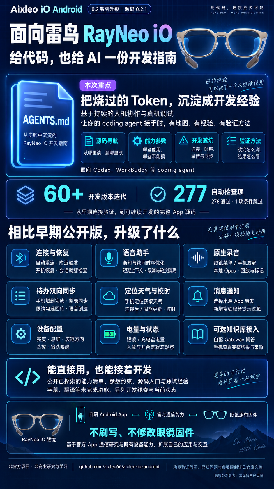

# Aixleo iO Android 0.2 系列（实际版本 0.2.1）

[项目首页](../../README.md) | [English](../en/README.md)

这是适配雷鸟 iO 的非官方 Android 研究 App，不是厂商发布的 SDK，也还没有稳定的独立 AAR。0.2.1 提供源码、固定版本的设备通信依赖和构建脚本；不提供维护者的 APK、签名或云服务密钥。

  

点击图片查看原图；功能验证范围与已知限制以正文及关联文档为准。

眼镜连接、原生录音、本地 Ogg Opus 保存、云端语音问答、手机眼镜待办同步、天气温度与手机校时、通知转发和部分设备设置已有实现；各项的真机覆盖程度不同。[功能与验证边界](FEATURES-0.2.1.md)把它们分开说明。官方界面可见但尚未由本 App 支持的配置见[设备能力参考](DEVICE-CAPABILITIES.md)。

按[构建与首次使用](BUILDING.md)自行编译和安装。连接前先结束官方 App 对同一副眼镜的会话及进程；已做的解绑实测未观察到眼镜数据清空，后续官方 App 或固件版本的行为尚未验证，解绑不能当成普通重连。录音不会自动转写，问答服务需自备账号与密钥，天气需位置与网络，通知需系统授权。操作时的常见问题见[排查指南](TROUBLESHOOTING.md)。

文档入口：[变更记录](CHANGELOG.md) · [兼容性](COMPATIBILITY.md) · [测试指南](TESTING.md) · [权限与隐私](PRIVACY.md) · [安全状态](SECURITY.md) · [第三方来源](THIRD_PARTY_NOTICES.md) · [许可范围](LICENSING.md) · [来源与致谢](PROVENANCE.md)。历史审计文件按原版本保留，不代表 0.2.1 已重新验收全部场景。

开发入口：[能力清单与参数](CAPABILITY-MAP.md) · [命令行工具](TOOLS.md)。构建后的手机应用名为 **AIX IO SDK Lab**，版本 0.2.1；项目名称与手机图标标题不同。

AI 辅助开发：[AGENTS.md](../../AGENTS.md) · [开发路线与踩坑](DEVELOPMENT.md)。从任务定位源码和测试，无需先阅读完整 Android 逆向资料。
