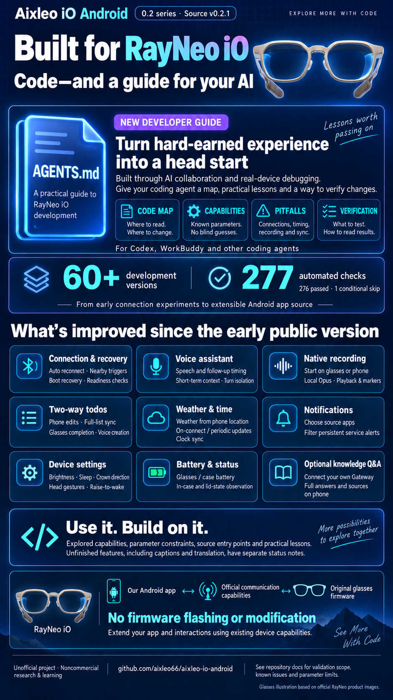

# Aixleo iO Android 0.2 series (exact build: 0.2.1)

[Project home](../../README.md) | [简体中文](../cn/README.md)

This is an unofficial Android research app for RayNeo iO, not a vendor SDK or a stable Android AAR. Version 0.2.1 contains app source, a pinned device communication dependency and build tooling. It does not include the maintainer's APK, signing key, cloud credentials or personal data.

  

Click the image for full resolution. Validation scope and known limits are described below and in the linked feature documents.

The app implements device sessions and limited automatic reconnect, native glasses recording saved locally as Ogg Opus, cloud-backed voice answers, phone–glasses todo sync, location-based weather and clock sync, notification forwarding, and a subset of device settings. Validation varies by feature and environment; see the [feature and validation matrix](FEATURES-0.2.1.md). The [device capabilities overview](DEVICE-CAPABILITIES.md) distinguishes observed official controls from controls implemented here.

Use the [build guide](BUILDING.md) for a local build. End the official app's connection and process before connecting the same glasses to this app. Our unbinding tests did not clear glasses data; behavior after future official-app or firmware updates has not been verified. Unbinding is still not a routine reconnect step. Recording does not automatically transcribe; voice services require your own credentials, weather requires location and network access, and notifications require Android notification-listener permission.

See [troubleshooting](TROUBLESHOOTING.md), [changelog](CHANGELOG.md), [testing](TESTING.md), [validation records](AUDIT.md), [compatibility](COMPATIBILITY.md), [privacy](PRIVACY.md), [security](SECURITY.md), [third-party notices](THIRD_PARTY_NOTICES.md), and [licensing](LICENSING.md). The vendor binary is not relicensed by this project's PolyForm Noncommercial license; its redistribution authorization has not been verified in the existing provenance record. Historical audit pages describe their own versions and do not establish complete 0.2.1 validation.

## Capability and validation matrix

| Module | Implemented behavior | Evidence and limits |
| --- | --- | --- |
| Connection | Paired-device authentication and business sessions | Limited device validation; authentication/battery alone is not readiness. |
| Reconnection | Saved-device nearby/boot recovery and standby restoration | Single-day cases observed; overnight stability and OS background restrictions remain concerns. |
| Voice Q&A | Glasses audio → user-configured ASR/model → lens answer | Selected short-answer cases observed; requires credentials and network. |
| Follow-up | Short follow-up window, page-event timing and turn isolation | Limited real multi-round validation; not persistent semantic memory or complete timing coverage. |
| Voice commands | Explicit recording and todo phrases | Rule-based matching, not arbitrary task understanding. |
| Knowledge | Optional user-hosted Gateway; answers and source display | Experimental; server excluded, empty citations do not prove retrieval. |
| Recording | Phone/native-glasses initiation, local Ogg Opus | Minute-scale tested; long recordings and disconnect recovery not fully accepted; no automatic transcription. |
| Playback | Local replay, seeking and some marks; audio export from details | Not all official editing/sharing/recording-pause features. |
| Todos | Phone creation/completion/deletion and sync; glasses completion back to phone; explicit assistant creation on phone then sync back | Thirteen-item baseline and selected changes observed; native-list creation, reminders/account sync and concurrent conflicts incomplete. |
| Weather/time | Phone-location weather, ready/periodic temperature push, phone clock sync | Limited device checks; all-day background operation and movement refresh not fully verified. |
| Notifications | Selected system-notification forwarding, service-notification filtering | Selected real notifications observed; source app must emit a notification; in-place update unsupported. The persistent-notification filter added in 0.2.1 checks the foreground-service flag or `service` category; on a real device one "running" notice was not matched (cause unconfirmed) and was still forwarded. A user reported a workaround by disabling the corresponding Android notification channel; first check that this does not suppress actual messages. |
| Battery/case | Glasses battery and some case/lid states | Reports observed; continuous charging-case battery refresh unconfirmed. |
| Brightness | Manual lens level adjustment and partial settings readback | Limited lens comparison; indicator and lens auto brightness are distinct. |
| Sleep timeout | Supported timeout read/write | Five/ten-second round trips and wearer observation; other values need verification. |
| Crown direction | Direction read/switch | Reversal observed; not arbitrary key remapping. |
| Head-up/head gesture | Partial angle/switch/confirmation controls | Limited read/write and observation; configured degrees are not calibrated trigger angles. |

The phone app label is **AIX IO SDK Lab**, version 0.2.1. Builds remain debuggable; authorized ADB can read app state. See [security](SECURITY.md), [developer map](CAPABILITY-MAP.md) and [CLI tools](TOOLS.md).

AI-assisted development: [AGENTS.md](../../AGENTS.md) · [Development guide and pitfalls](DEVELOPMENT.md). Start with the requested change, relevant source and tests; reverse engineering the vendor app is not a prerequisite.
